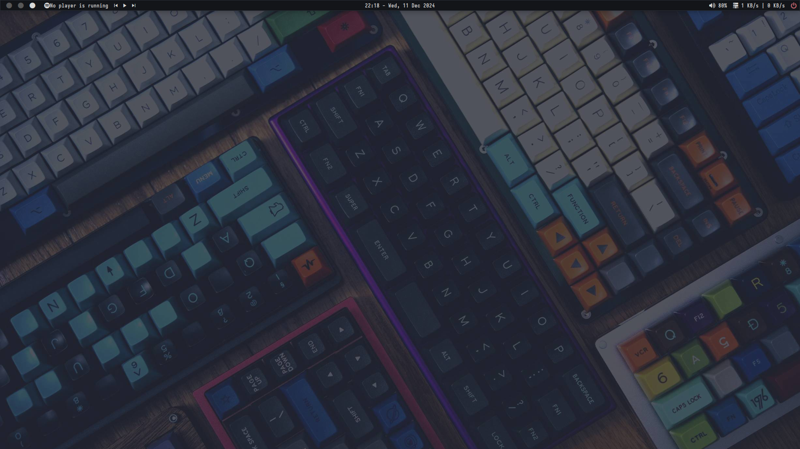
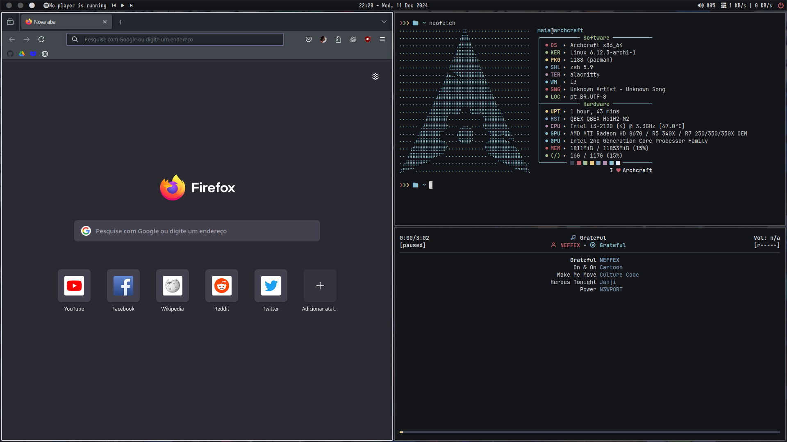
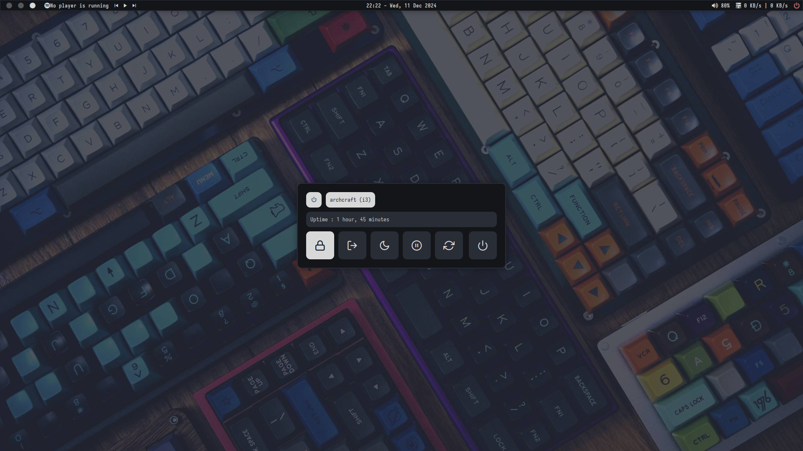
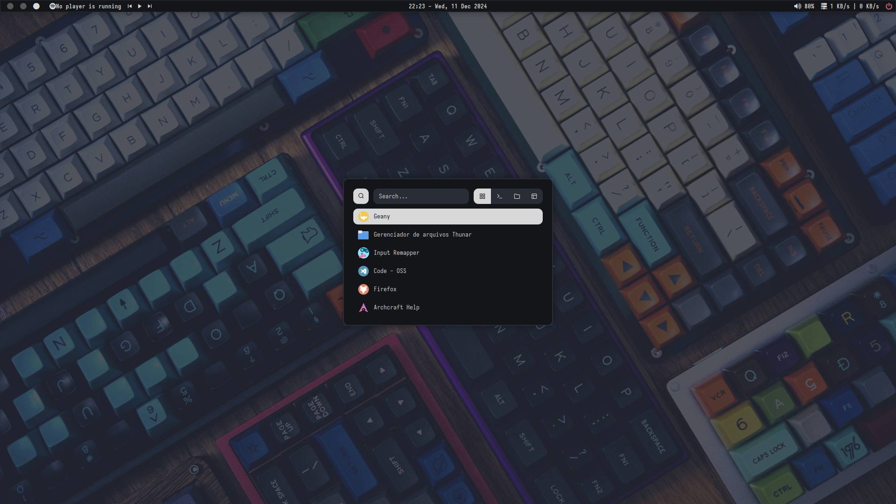

# i3-dotfiles
My dotfiles for i3wm

### Dependencies

- autotiling
- playerctl
- zscroll
- picom
- dunst
- polybar
- rofi

```bash
$ sudo pacman -S autotiling spotify-laucher playerctl picom polybar libsysprof-capture alsa-card-profiles rofi-lbonn-wayland-git
$ yay -S zscroll-git
```
### Screenshots

###### Clean

###### Neofetch

###### Powermenu

###### Rofi



### Keybinds

| Key | Action|
| --- | --- |
| <kbd>Super + Return</kbd> | Open terminal (Alacritty) |
| <kbd>Super + Shift + Return</kbd> | Open floating terminal |
| <kbd>Super + Alt + Return</kbd> | Open fullscreen terminal |
| <kbd>Super + e</kbd> | Open file manager (thunar) |
| <kbd>Super + w</kbd> | Open browser (firefox) |
| <kbd>Control + Alt + v</kbd> | Open vim |
| <kbd>Control + Alt + r</kbd> | Open ranger |
| <kbd>Control + Alt + h</kbd> | Open htop |
| <kbd>Control + Alt + m</kbd> | Open music player (ncmpcpp) |
| <kbd>Alt + F1</kbd> | Open rofi |
| <kbd>Alt + F2</kbd> | Open rofi runner |
| <kbd>Super + n</kbd> | Open network applet |
| <kbd>Super + x</kbd> | Open power menu |
| <kbd>Super + a</kbd> | Open rofi windows |
| <kbd>Super + m</kbd> | Open rofi music |
| <kbd>Super + r</kbd> | Launch open as root |
| <kbd>Super + s</kbd> | Open screenshot applet |
| <kbd>XF86MonBrightnessUp</kbd> | Incease brightness |
| <kbd>XF86MonBrightnessDown</kbd> | Decrease brightness |
| <kbd>XF86AudioRaiseVolume</kbd> | Incease volume |
| <kbd>XF86AudioLowerVolume</kbd> | Decease volume |
| <kbd>XF86AudioMute</kbd> | Toggle mute mode |
| <kbd>XF86AudioMicMute</kbd> | Toggle mic mute mode |
| <kbd>XF86AudioNext</kbd> | mpc next song |
| <kbd>XF86AudioPrev</kbd> | mpc previous song |
| <kbd>XF86AudioPlay</kbd> | Toggle play/pause mode |
| <kbd>XF86AudioStop</kbd> | Stop song |
| <kbd>PrtSc</kbd> | Take a screenshot |
| <kbd><Control + PrtSc/kbd> | Take a screenshot with 5 sec delay |
| <kbd>Shift + PrtSc</kbd> | Take a screenshot with 10 sec delay |
| <kbd>Control + Shift + PrtSc</kbd> | Take a window screenshot |
| <kbd>Super + PrtSc</kbd> | Take area screenshot
| <kbd>Super + p</kbd> | Lauch color picker |
| <kbd>Control + Alt + l</kbd> | Lauch lockscreen |
| <kbd>Super + Control + x</kbd> | Shutdow |
| <kbd>Super + q</kbd> | Close focused window |
| <kbd>Super + c</kbd> | Close focused window |
| <kbd>Super + v</kbd> | Toggle split mode |
| <kbd>Super + Shift + s</kbd> | Change to stacking layout style |
| <kbd>Super + Shift + t</kbd> | Change to tabbed layout style |
| <kbd>Super + Shift + d</kbd> | Change to default Layout |
| <kbd>Super + f</kbd> | Toggle fullscreen |
| <kbd>Super + Space</kbd> | Toggle floating |
| <kbd>Super + Up/Down/Left/Right</kbd> | Change focus to Up/Down/Left/Right window |
| <kbd>Super + h/j/k/l</kbd> | Change focus to Left/Down/Up/Right window |
| <kbd>Super + Tab</kbd> | Change focus to next window |
| <kbd>Super + Shift + Left/Down/Right/Up</kbd> | Move window to Left/Down/Right/Up direction |
| <kbd>Super + Shift + h/j/k/l</kbd> | Move window to Left/Down/Right/Up direction |
| <kbd>Super + Alt + c</kbd> | Move to center|
| <kbd>Super + Alt + p</kbd> | Move to position mouse |
| <kbd>Super + Alt + Left/Down/Right/Up</kbd> | Resize to Left/Down/Right/ direction |
| <kbd>Super + Alt + h/j/k/l</kbd> | Resize to Left/Down/Right/Up direction
| <kbd>Super + y</kbd> | Toggle border style |
| <kbd>Super + Shift + c</kbd> | Reload i3 |
| <kbd>Super + Shift + q</kbd> | Exit I3 |
| <kbd>Super + 1/2/3/4/5</kbd> | switch to workspace /(1/2/3/4/5) |
| <kbd>Super + Shift + 1/2/3/4/5</kbd> | Move the container to numbered workspace
| <kbd>Super + Control + Right</kbd> | Move container to next workspace |
| <kbd>Super + Control + Left</kbd> | Move container to previous workspace |
